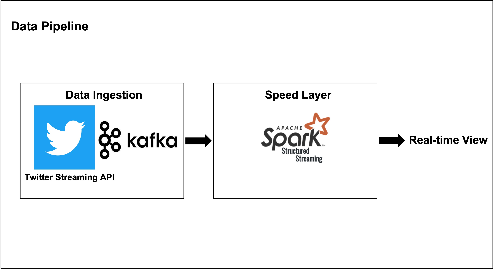

# Top Trending HashTags

> Hello World To Data Engineering

> Twitter Streaming API, Kafka, Spark를 활용한 실시간 Top Trending HashTags 분석

## Table of Contents

- [About](#About)
  - [Team](#Team)
- [Getting Started](#Getting-Started)
  - [Prerequisites](#Prerequisites)
  - [Usage](#Usage)
- [License](#License)
- [Acknowledgements](#Acknowledgements)

## About

### Team

- [김홍엽](https://github.com/hngyb)
- [이규복](https://github.com/gyubok-lee)

## Getting Started

### Prerequisites

- python 3.8.12
- zookeeper 3.7.0_1
- kafka 3.0.0
- kafka-python 2.0.2
- pyspark 3.2.0
- tweepy 4.1.0

### Usage

1. zookeeper, kafka 실행
2. [getTweetsStreaming.ipynb 실행](./dataIngestion/getTweetsStreaming.ipynb)
3. [pysparkStructuredStreaming.ipynb 실행](./speedLayer/pysparkStructuredStreaming.ipynb)

## License

MIT License

## Acknowledgements

- [https://ch-nabarun.medium.com/easy-to-play-with-twitter-data-using-spark-structured-streaming-76fe86f1f81c](https://ch-nabarun.medium.com/easy-to-play-with-twitter-data-using-spark-structured-streaming-76fe86f1f81c)
- [https://velog.io/@shinychan95/Twitter-API를-활용하여-실시간-tweet을-kafka로-보내기](https://velog.io/@shinychan95/Twitter-API를-활용하여-실시간-tweet을-kafka로-보내기)
